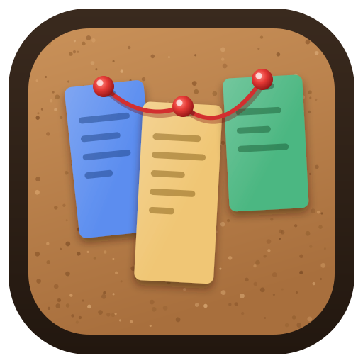
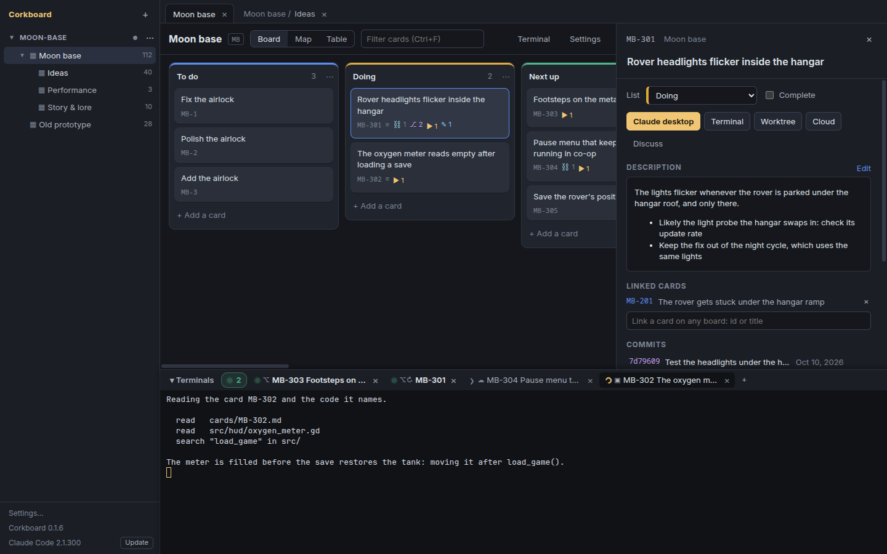

  

<h1 align="center">Corkboard</h1>

  A kanban board and mind map kept as plain files in git, that hands its cards to Claude Code and follows them to their commits.

  <a href="https://github.com/agaudreau1997/corkboard/releases/latest">Download</a> ·
  <a href="docs/README.md">Documentation</a> ·
  <a href="CONTRIBUTING.md">Contributing</a>

## What it's for

**Notes and task lists you own.** Corkboard is a desktop board for whatever you keep lists of: lists as columns and cards you drag between them, a mind map of the same cards to think in, a table to sort them. Boards nest like folders, and every project can wear its own colours. Each card is a Markdown file in a git repo that the app commits and syncs between your machines by itself, so your notes stay plain text: readable in any editor, versioned, never locked in an app. None of this needs Claude.

**A pipeline from card to commit.** When a card is work for code, one click hands it to a Claude Code session, with the card's title, description and linked cards as its prompt: in a terminal inside the app, in its own git worktree, in the Claude desktop app, or in the cloud. A whole list or a selection goes as one session, or as one per card in parallel. The session moves the card along by editing its file, the card keeps the session so you can resume it, and the commits that name the card show on it. Before anything is built, *Discuss* talks a card or a whole list through with Claude and writes the outcome back into the cards.

## Highlights

### Board, map and table: three views of the same cards

Drag cards and lists, select several and move them together, double-click to rename in place. The map lays each list out on a backdrop, draws the links between cards, and turns a double-click into a new idea.

### A card knows its sessions and its commits

The drawer shows a card's description in Markdown, its links to cards on any board, the commits in the code repo whose `Card:` trailer names it (click one for the files it touched), and every Claude session started for it, ready to resume in a terminal or open in the desktop app.

### Terminals that show whose turn it is

Each session runs in a tab of the terminal panel. A spinner means Claude is working, a green dot means it's your turn, and a turn that ends in a tab you aren't looking at says so. When Claude finishes a turn while the window is in the background, a desktop notification says so, and a program of yours can run on every change, for a sound or a lamp.

### Colours per project

Six themes to start from and a picker per colour, kept in the board repo so every machine shows the project the same way.

## Install

Download the newest release from the [releases page](https://github.com/agaudreau1997/corkboard/releases/latest):

| Platform | Download | |
| --- | --- | --- |
| Windows | `Corkboard-Setup-<version>.exe` | An installer; updates itself. |
| | `Corkboard-<version>.exe` | Portable, no install; tells you when a new one is out. |
| Linux | `Corkboard-<version>.AppImage` | Any distribution (needs FUSE 2); updates itself. |
| | `corkboard-<version>.x86_64.rpm` | Fedora and friends: `sudo dnf install ./corkboard-*.rpm`; updates through dnf. |
| macOS | | No package yet: [run it from source](docs/development.md#running-from-source). |

The Windows exes are unsigned, so SmartScreen warns on first run (*More info → Run anyway*). To tackle cards, install [Claude Code](https://docs.anthropic.com/en/docs/claude-code) too: Corkboard runs the same `claude` your terminal does.

## Quick start

1. **Add a project.** The first launch asks for one. Pick an empty folder: it becomes a board repo, with a README and a `CLAUDE.md` that tells Claude sessions the card format. (Or pick a clone of a board repo you already have.) Give the repo a remote and the app syncs it.
2. **Make a board.** *+ New board* under the project, then add lists and cards. Double-click a card to rename it, click it to open its drawer.
3. **Point it at your code.** The board's *Settings* takes the code repo its cards are about.
4. **Tackle a card.** Open it and press *Terminal* (or *Worktree*, *Claude desktop*, *Cloud*). The card moves to *Doing* and a session starts in the terminal panel with the card as its prompt; its commits show on the card, and the session moves the card to *Done* once the work is verified.

## Documentation

- [Using Corkboard](docs/using.md): projects, boards, the three views, the menus, updates.
- [Tackling with Claude](docs/tackling.md): the tackle buttons, the prompts, commits on cards, discussions, the terminal tabs.
- [Work mode](docs/work-mode.md): for code repos shared with teammates or clients, where Jira keys stand in for card ids.
- [The board repo](docs/board-repo.md): the files, the auto-commit and the sync.
- [Building, releases and tests](docs/development.md): running from source, packaging, releasing, testing.

## Contributing

Contributions are welcome: see [CONTRIBUTING.md](CONTRIBUTING.md).

## License

Corkboard is free software: you can redistribute it and/or modify it under the terms of the GNU General Public License as published by the Free Software Foundation, either version 3 of the License, or (at your option) any later version. It is distributed in the hope that it will be useful, but WITHOUT ANY WARRANTY; without even the implied warranty of MERCHANTABILITY or FITNESS FOR A PARTICULAR PURPOSE. See the GNU General Public License in [LICENSE](LICENSE) for more details.

Copyright (C) 2026 agaudreau1997 and contributors.
