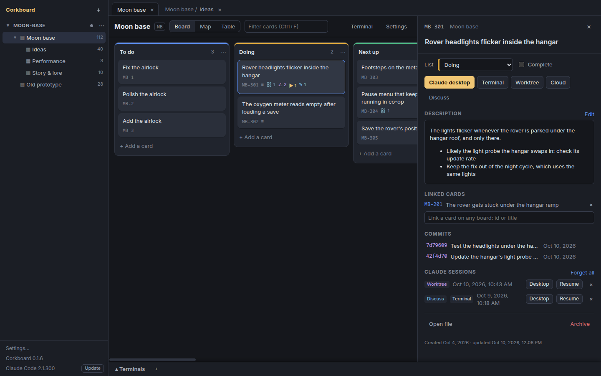
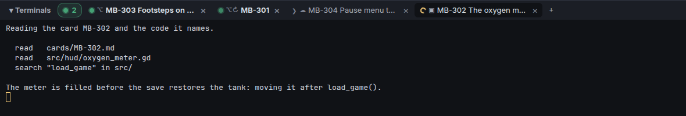

# Tackling with Claude

A card is a prompt waiting to be sent. Corkboard starts Claude Code sessions from cards, lists and selections, keeps them in terminal tabs that show whose turn it is, records them on their cards so they can be resumed, and shows on each card the commits that name it.

## Tackle

From a card: *Tackle locally*, *In a worktree* or *Claude Cloud*. From a list header (*Tackle all*) or a selection of two or more (Ctrl/Shift-click cards; with a card open in the drawer, the selection starts from it): one local session for all of them in order, one session per card in parallel (each in its own worktree), or one cloud session. Every session runs in the embedded terminal panel (Ctrl+`), is recorded on its cards (`sessions:`), and can be resumed from the card; the card face shows a ▶ badge for them until the card is done (in the board's done list, or marked complete), the drawer keeps them after.

### The tackle buttons

| Button | Runs |
| --- | --- |
| Claude desktop | opens `claude://code/new?q=<prompt>&folder=<code repo>`: a new Code session in the Claude desktop app, in the code repo once you trust it (the app asks each time), the prompt filled in (a prompt over 14,000 characters goes in a temporary file the link points to). The link can't pick a branch, and a draft sent with its branch blank starts with no folder: pick the branch before sending. The prompt names the code repo, and a session that started anywhere else moves itself there with the desktop app's `change_directory` tool (you approve the folder), or stops and says so |
| Terminal | `claude --add-dir <board repo> -n "<ID> <title>" --session-id <uuid> "<prompt>"` in the board's code repo (`--add-dir` first: it takes every folder up to the next option, and placed last it swallowed the prompt) |
| In a worktree | the same plus `-w card-<id>` (Claude Code makes `.claude/worktrees/card-<id>` on branch `worktree-card-<id>`); in a work project `-w <Jira key>`, or a slug of the title without one |
| Claude Cloud | `claude --cloud "<prompt>"`: a claude.ai/code session on GitHub's copy of the current branch (push first); the URL it prints is saved on the card |

### The prompt

The prompt carries the card's title, description and linked cards, the path of its file (with a pointer to the board repo's `CLAUDE.md`, when it has one), and the rules: put a `Card: <ID>` trailer on every commit (in a work project: name the Jira key and write no card id into the code repo), move the card to the board's done list when it is verified (`flow.done` in the board settings; nothing is said when it is unset), and never commit in the board repo. Board settings also hold *Prompt notes*, appended to every prompt, and the list a tackled card moves to (`flow.doing`).

### The desktop app's links

The desktop app's links were read from the app (2.19675): `claude://code/new?q=&folder=` (one folder: given two, the app ignores both and opens the last folder it used; no branch, which Anthropic's page on the link confirms: it takes `q`, `folder` and `file`), `claude://code/continue?session=local_<id>` (one of its sessions) and `claude://resume?session=<uuid>` (imports a CLI session); only the first is documented. After a desktop tackle the app watches the desktop app's own session index (`~/.config/Claude/claude-code-sessions/**/local_*.json`: its id, the CLI session id, the folder, the start time) for a session whose transcript starts with the prompt, in whatever folder it started (the index keeps a scratch workspace's after the session moves), for up to 30 minutes, and puts both ids on the card: its *Open* button reopens it in the desktop app. A terminal session's *Desktop* button imports it into the desktop app. If an app update moves these, a desktop tackle still opens the session; only the link back to the card is lost.

## Cards ↔ code

A board names its code repo (`codeRepo`, inherited by child boards). Commits there that carry a `Card: RS-886` trailer show on the card, on any branch. Click one in the drawer for the files it touched; *Copy* (on hover) or its right-click menu copies its SHA. In a [work project](work-mode.md) the card shows the commits that name its Jira key instead.

## Discuss before tackling

*Discuss* on a card (its drawer, or its menu) and *Discuss / triage* on a list or a selection open one conversation, in Claude desktop or a terminal, that may not implement anything: no code changes, no new files, no commits in the code repo unless you ask in it. Claude reads the cards and the code and talks them through (what's unclear, risks, scope, splitting; for a list: still relevant, ready, to split, merge, move or archive), and once you agree it writes the outcome into the card files themselves, which is how a card gets its details before it's tackled. A discussion leaves the cards in their lists and shows as ✎ on the card.

## Terminal tabs show what Claude is doing

Each tab's icon: a spinner while Claude works, a green dot when it's your turn (Claude at its prompt or asking something), `❯` for a plain shell, a square once the shell ended (red for a failure). Beside it, what the tab holds: `▣` a Claude session started in the code repo, `⌥` one in a worktree, `☁` a cloud one, with `↻` after it when it resumes a session from a card; a plain shell has none. Its tooltip names the kind and a worktree's folder. A turn that ends in a tab you aren't looking at pulses and bolds the tab, and a count by *Terminals* jumps to it. The app reads this from the terminal title Claude Code sets (`◐`/`◑` while it works, `✳` when it stops, cleared on exit; read from 2.1.289), so a `claude` typed in a shell tab shows too; with `CLAUDE_CODE_DISABLE_TERMINAL_TITLE` set the tab stays a shell. A middle click on a tab closes it, like `×`; either asks first while Claude is working in it or a command runs in its foreground (a dev server, an editor: on Linux and macOS), not when it sits at a prompt.

## Your turn comes as a desktop notification

When Claude finishes a turn while Corkboard's window is in the background, the system's own notification says so with the tab's title, and clicking it brings the window up on that tab. *Settings…* at the bottom of the side panel turns it off.

## A program of yours runs when a tab changes state

*Settings…* at the bottom of the side panel also takes a notification program (a script or an executable, no arguments; on Windows a `.ps1`, `.cmd` or `.bat` works too), kept on this machine, and *Try it* runs it with a `test` event. The app runs it on every change: `working` when Claude starts a turn, `waiting` when it stops (your turn), `shell` once it left, `exit` when the tab's shell ends. The event, the status before it and the tab's title come as arguments, and everything in variables: `CORKBOARD_EVENT`, `CORKBOARD_PREVIOUS`, `CORKBOARD_TITLE`, `CORKBOARD_CARDS` (the tab's card ids, space-separated), `CORKBOARD_CWD`, `CORKBOARD_TERMINAL`, `CORKBOARD_KIND` (`shell`, `local`, `local-worktree` or `cloud`), `CORKBOARD_RESUMED` (`1`, for a resumed session) and, on `exit`, `CORKBOARD_EXIT_CODE`. The title is the session's name alone: a cloud or resumed tab's no longer starts with `☁ ` or `↻ `, the two variables say it instead. A sound, a lamp or a push to your phone is a two-line script: `[ "$CORKBOARD_EVENT" = waiting ] && paplay ~/ding.oga`; a program that showed a desktop notification of its own is no longer needed. A program that fails is logged, not shown; one that runs for more than 30 seconds is stopped.

## Which Claude Code

The app runs whatever `claude` your login shell finds, the same one your own terminal uses; the sidebar shows its version, and *Update* runs `claude update` in a terminal tab. It does not pin its own copy: a second Claude Code inside the app would update separately from the one you use in a terminal, and Claude Code already keeps itself current.
