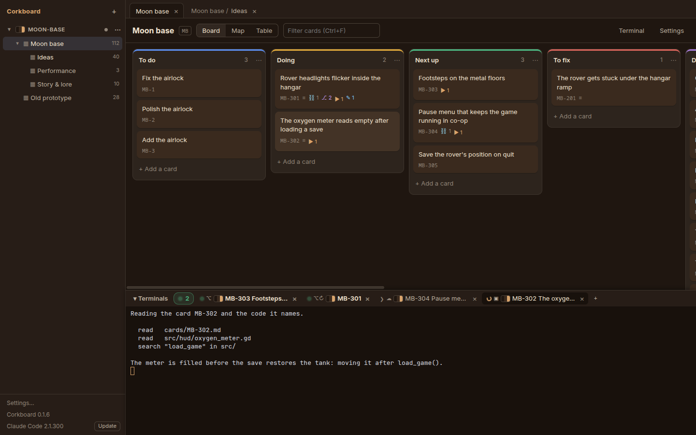
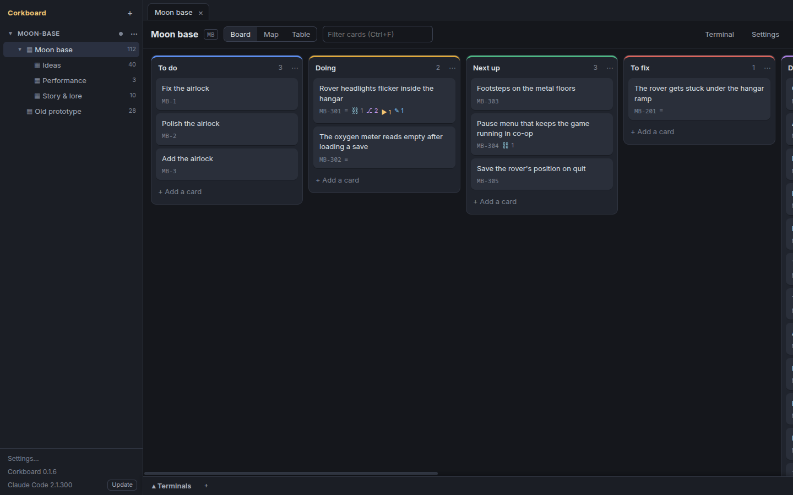
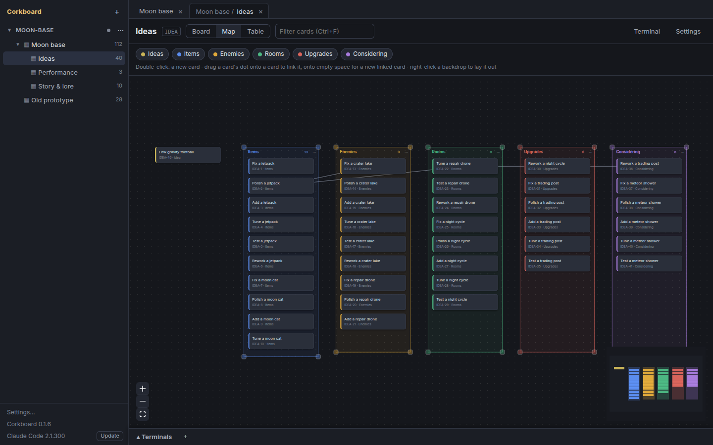

# Using Corkboard

Everything the window does, without Claude: projects, boards, cards, the three views, the menus and the updates. Handing cards to Claude Code is in [Tackling with Claude](tackling.md); the files behind it all are in [The board repo](board-repo.md).

## Projects

The side panel's top level is projects: each is one board repo, with its own sync and a code folder on this machine (*Settings…* in its menu) that its boards' sessions start in unless a board names its own. The `+` beside the *Corkboard* title adds a project: it takes an existing board repo (a clone of it) or an empty or new folder, which becomes a git repo with a README and a `CLAUDE.md` describing the card format (for Claude sessions and anyone editing cards by hand). A board repo without a `CLAUDE.md` gets an offer of one under its boards, never the file unasked; after *No thanks* the project's menu still has *Add a CLAUDE.md*. Removing a project only takes it off the list. A board moves to another project with its child boards and card ids (*Move to project* in its menu, refused when a key is taken there).

A project whose code repos are shared with teammates or clients can keep its card ids to itself: see [Work mode](work-mode.md).

## Project colours



A project can wear colours of its own, so a glance at the window says which one is in front. *Settings…* in its menu (or *Project colours…* in a board's settings) offers themes to start from (*Cork*, the icon's; *Moss*, *Tide*, *Plum*, *Ember*; *Paper*, a light one) and a picker per colour (background, cards, text, borders, accent, links, success, danger); the window shows them as you pick, and the side panel and the tabs carry each themed project's swatch. A terminal keeps the colours of the project it was opened for, whichever board is in front, and its tab carries that project's swatch; *claude update* and a shell opened with no board keep the app's. They live in `theme.json` at the root of the board repo, so every machine shows them, and an edit there, by hand or by a Claude session, shows at once. A change of colours (another project's tab, an edit on disk) crossfades the whole window, terminals included, in a fifth of a second; picks in the settings, and a system set to reduce motion, swap at once. A colour left unset is mixed from the others; `"tokens": { "--panel": "#16161d" }` pins any of the stylesheet's shades exactly, to match a design system.

## Boards and cards

Each board is a folder with a `board.json`; a board folder can hold child boards, so boards nest like folders. Every board you open is a tab; `+` (or right-click → *New board inside…*) creates one. *Delete board…* removes an empty board (archived cards don't count) at once and one with cards (and child boards) once its name is typed; all of it stays in the repo's git history.

Cards are Markdown files (`cards/<ID>.md`: YAML front matter, then the description), so a move is a one-line diff and a Claude session can move a card by editing `list:`. The app watches the folder, so that move shows up on screen at once. It commits the board repo itself and keeps it in sync between machines: see [The board repo](board-repo.md).

## Three views of the same cards

A click on a card in any of them opens its drawer; click the id at the drawer's top left to copy it.

### Board



Lists as columns, drag and drop. Dragging one card of a selection (Ctrl/Shift-click) moves the whole selection, dropped together in board order; dragging a card raises a tray at the bottom with *Map only (idea)* and *Archive* drop zones. Drag the empty background to pan, with momentum; a list taller than the board runs on under the terminal panel and scrolls inside the board. *+ Add a list* at the end; drag a list by its header to reorder the lists (each keeps its colour), double-click a list title to rename it. Double-click a card to edit its title in place on the card (Enter saves, Shift+Enter starts a line, Escape cancels). A list over 60 cards shows the first 60 until you ask.

### Map



A free canvas: cards are nodes, `links` are the lines between them. Every list has a backdrop its cards sit on, dragged by its header (its cards come along) and resized from its corners; a backdrop grows to hold every card of its list, even one dropped outside it or added from elsewhere (only *Fit to its cards* shrinks it); dropping a card on another list's backdrop moves it to that list. Right-click a backdrop for *Automatically lay out* (its cards in columns inside it), *Fit to its cards*, *Add a card here*.

Double-click opens a title input for a new card (in the backdrop under it, else an idea with no list); dragging a card's dot onto another card links them, onto empty space opens the input for a new card linked from it; Escape or an empty title adds nothing. Positions and backdrops are kept in `map.json`.

### Table

Sortable, archived cards on request.

## Right-click menus

- **Card**: open; tackle (in Claude desktop, a terminal, a worktree, Claude Cloud; or the selection); discuss; move to another list or to a list of another board (the card keeps its id, so its commits and links still find it); move to top / bottom; link to a card on any board; copy the id, title, `Card:` trailer (the Jira key, in a work project), Markdown, file path, or the tackle or discuss prompt (to paste into a Claude session of your own); select; mark complete; duplicate; open the file; archive.
- **List** (or its `⋯`): add a card; rename; tackle all (Claude desktop together or one per card, a terminal session, terminals in parallel with a worktree each, one cloud session, or one per card); discuss / triage; select all cards; *Sort cards by* last update (a card that changes or lands in the list goes to the top; the default for the board's done list), age, number or title, kept in `board.json` and applied as cards change, or *Manual* for drag-and-drop order (the default for every other list); move left / right; move the list and its cards to another board; collapse; copy as a Markdown checklist; archive its cards; archive the list (restore it in the board settings).
- **Board** (side panel): open in a view, new board inside, settings, a terminal in its code repo, copy its key, delete (empty boards only).
- **Terminal**: copy the selection, paste, select all. The keys: Ctrl+C copies while text is selected (without a selection it interrupts, as ever, and a copy clears the selection, so a second press interrupts), Ctrl+Shift+C copies, Ctrl+Shift+V pastes, and on Windows Ctrl+V pastes too (elsewhere it goes to the program: Claude Code pastes an image on it). Ctrl+click (Cmd+click on macOS) opens a link in the browser: a URL printed as text, or a link Claude Code writes; a plain click still selects.

## Updates

The side panel's foot shows the Corkboard version running; click it for its release notes. An installed Corkboard looks for a newer published release when it starts and every four hours, and what it does with one depends on how it was installed:

- **Windows installer** (the Setup exe): downloads it in the background and installs it silently at the next quit, or at once with *Restart to update*.
- **AppImage**: downloads the new one and replaces the file where it lies (`~/.local/lib/corkboard/Corkboard.AppImage` after `npm run install-launcher:appimage`), at the next quit or on *Restart to update*.
- **rpm**: downloads the new rpm and installs it with dnf behind a password prompt, at the next quit or on *Restart to update*, so dnf still tracks the package.
- **Portable exe**: can't update itself. The side panel says *Corkboard <version> is out*, and *Download* opens the release page.

*Restart to update* asks first when terminals are running (restarting stops them, and the Claude sessions in them, which resume from their cards), then commits and pushes the board repos as a quit does, and only then installs. A development build, a copy run from `dist/linux-unpacked` or `dist/win-unpacked`, and the end-to-end test never look. The first copy with the updater (0.1.3; the 0.1.2 rpm clashes with other Electron apps) is installed by hand: `sudo dnf install ./corkboard-<version>.x86_64.rpm`, the Setup exe, or the AppImage. The exes are unsigned, so SmartScreen warns about the first download, not about the updates the app installs.

## Importing from Trello

`scripts/import-trello.mts` turns the raw JSON the Trello connector returns (one folder per board) into board folders; its `PLAN` maps Trello boards to folders and keys.

```bash
node scripts/import-trello.mts <export dir> <board repo>
```
